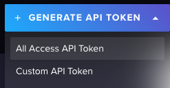
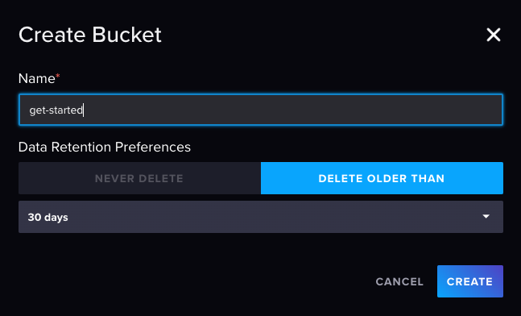
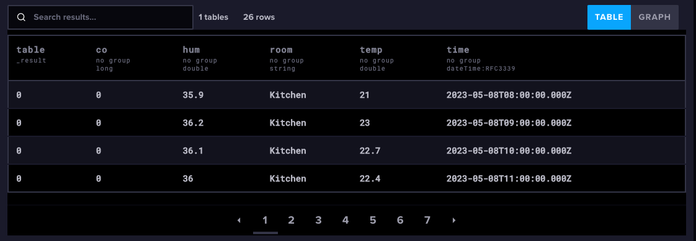
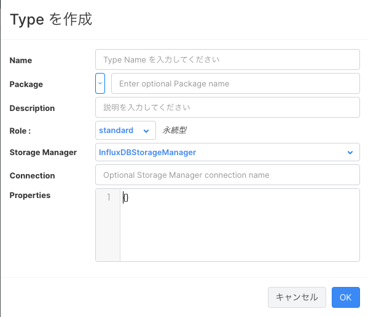
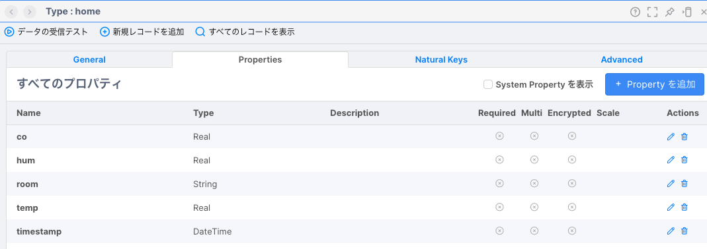
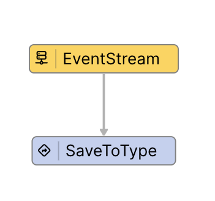
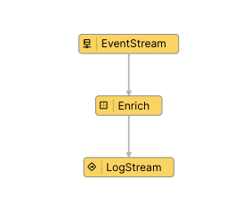
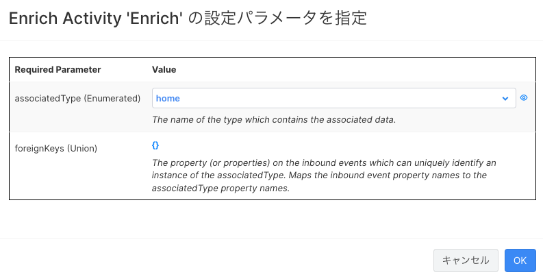

# InfluxDB Storage Manager

## Storage Managerとは

- Vantiqでは、データの永続化にMongoDBを使用しています。Vantiq 1.35で追加されたStorage Managerの機能を使用することにより、MongoDB以外のデータベースを使用してデータを永続化しVantiq Typeとして使用することができます。Storage Managerの詳細に関しては[公式リファレンス](https://dev.vantiq.com/docs/system/storagemanagers/index.html)を参照してください。

## InfluxDB Storage Managerについて

- Storage Managerは、使用したいデータベースに合わせて個別に実装する必要がありますが、InfluxDB 用のリファレンスStorage ManagerがVantiqより提供されています。このStorage Managerを使用することで、InfluxDB を使用してデータを永続化できVantiqアプリでTypeとして使用することができます。

**Note**
本ドキュメントでは、InfluxDB Cloud の使用を前提とします。InfluxDB OSSによるローカル環境での使用に関しては未検証です。
また、InfluxDB Storage Manager のDescriptionでは明記されていませんが、OrganizationやBucketを指定する必要があることからInfluxDB v2.0以降が対象となります。

## InfluxDB Storage Managerの使用

### InfluxDB Cloudの準備

InfluxDB Cloud Serverlessを使用するためには、InfluxDB Cloudのアカウントが必要です。アカウントをお持ちでない場合は、[InfluxDB Cloud](https://cloud2.influxdata.com/signup)からアカウントを作成してください。

#### セットアップ

[公式のチュートリアル](https://docs.influxdata.com/influxdb/cloud-serverless/get-started/setup/)にしたがい、InfluxDB をセットアップします。

1. API TOKEN の作成
   VantiqからInfluxDB CloudにアクセスするためのAPI TOKENを作成します。[InfluxDB Cloud](https://cloud2.influxdata.com/)にアクセスし、[Load Data] > [API TOKENS]に移動して`Generate Token`をクリックし、`All Access API Token`を選択します。

   

   作成されたAPI TOKENを控えておきます。
2. バケットの作成
   InfluxDB Cloudにデータを保存するためには、バケットを作成する必要があります。[InfluxDB Cloud](https://cloud2.influxdata.com/)にアクセスし[Load Data] > [Bucket]に移動して`Create Bucket`をクリックします。
   
   
   
   ここでは`get-started` バケットを作成します。
3. データの書き込み
   作成したバケットにデータを書き込んでみます。InfluxDBのデータ構造の詳細に関しては、[公式のリファレンス](https://docs.influxdata.com/influxdb/cloud-serverless/reference/syntax/line-protocol/) を参照してください。
   [InfluxDB Cloud](https://cloud2.influxdata.com/)にアクセスし[Load Data] > [Bucket]に移動して書き込みたいバケットの`ADD DATA` をクリック、`Line Protocol` を選択します。
   
   
   
   `ENTER MANUALLY` を選択し、以下のデータを入力します。

   ```csv
   home,room=Living\ Room temp=21.1,hum=35.9,co=0 1683532800
   home,room=Kitchen temp=21.0,hum=35.9,co=0 1683532800
   home,room=Living\ Room temp=21.4,hum=35.9,co=0 1683536400
   home,room=Kitchen temp=23.0,hum=36.2,co=0 1683536400
   home,room=Living\ Room temp=21.8,hum=36.0,co=0 1683540000
   home,room=Kitchen temp=22.7,hum=36.1,co=0 1683540000
   home,room=Living\ Room temp=22.2,hum=36.0,co=0 1683543600
   home,room=Kitchen temp=22.4,hum=36.0,co=0 1683543600
   home,room=Living\ Room temp=22.2,hum=35.9,co=0 1683547200
   home,room=Kitchen temp=22.5,hum=36.0,co=0 1683547200
   home,room=Living\ Room temp=22.4,hum=36.0,co=0 1683550800
   home,room=Kitchen temp=22.8,hum=36.5,co=1 1683550800
   home,room=Living\ Room temp=22.3,hum=36.1,co=0 1683554400
   home,room=Kitchen temp=22.8,hum=36.3,co=1 1683554400
   home,room=Living\ Room temp=22.3,hum=36.1,co=1 1683558000
   home,room=Kitchen temp=22.7,hum=36.2,co=3 1683558000
   home,room=Living\ Room temp=22.4,hum=36.0,co=4 1683561600
   home,room=Kitchen temp=22.4,hum=36.0,co=7 1683561600
   home,room=Living\ Room temp=22.6,hum=35.9,co=5 1683565200
   home,room=Kitchen temp=22.7,hum=36.0,co=9 1683565200
   home,room=Living\ Room temp=22.8,hum=36.2,co=9 1683568800
   home,room=Kitchen temp=23.3,hum=36.9,co=18 1683568800
   home,room=Living\ Room temp=22.5,hum=36.3,co=14 1683572400
   home,room=Kitchen temp=23.1,hum=36.6,co=22 1683572400
   home,room=Living\ Room temp=22.2,hum=36.4,co=17 1683576000
   home,room=Kitchen temp=22.7,hum=36.5,co=26 1683576000

   ```

   [Precision]ドロップダウン メニューで [Seconds]を選択し、[Write Data]をクリックしデータを書き込みます。
   
   
4. データのクエリ
   書き込んだデータをクエリしてみます。[InfluxDB Cloud](https://cloud2.influxdata.com/)にアクセスし[Data Explorer]に移動し、左のSchema Browserの[Bucket]ドロップダウン メニューから `get-started`バケットを選択します。
   エディターに以下のクエリを入力し、[RUN] をクリックするとクエリが実行されます。

   ```sql
    SELECT
      *
    FROM
      home
    WHERE
      time >= '2023-05-08T08:00:00Z'
      AND time <= '2023-05-08T20:00:00Z'
   ```

   

   クエリの結果が表示されます。
   
   

### InfluxDB Storage Managerのインストール

1. Vantiq CatalogからInfluxDB Storage ManagerのAssemblyをインストールします。
   1. VantiqのUIで、[追加] > [Assemblies] を選択します。
   1. . `InfluxStorageManager` をクリックし、Assemblyをインストールします。

      

   1. Config を編集します。

      

      必要に応じてInfluxURLのOverride値を設定してください。requestDefaults は以下の内容を設定してください。

         ```json
         {
            "headers": {
               "Authorization": "Token <Your Token>"
               },
            "query": {
               "org": "<Your Organization>"
               }
         }
         ```

   1. Project に InfluxStorageManager が追加されました。

      

### Typeの作成

1. Vantiq UIから新規Typeを作成します。

   

1. Type名には、InfluxDB の `measurement` を指定します。ここでは `home` となります。
1. Role は永続型の`standard`、Storage Managerは`InfluxStorageManager`が選択可能となっているので選択します。
1. Properties では、InfluxDB のBucket、Tag、Precision を指定します。以下の通り指定します。

   ```json
    { 
        "bucket": "get-started", 
        "tags": [ "room" ], 
        "precision": "s" 
    }
   ```

1. TypeのProperties を追加します。`timestamp`のみがデフォルトで設定されています。 InfluxDB のTag、Field に対応するProperty を追加します。

   

1. [すべてのレコードを表示]でデータを確認してみます。

   

**Note**
InfluxDBは、データを`measurement`、`tag`、`field`の組み合わせからなる`Series` として保存します。co、temp、humの個々のフィールドは別々のSeries（テーブル）に配置されます。Storage Managerは個々のSeriesの内容を結合しないため、Selectの結果は一つのタイムスタンプ・Tag(room) の組み合わせに対しco、temp、humの3種類の結果が返されます。
以下はInfluxDBbに直接Flux クエリを発行した結果です。

```sql
from(bucket: "get-started")
    |> range(start: -30d)
    |> filter(fn: (r) => r._measurement == "home" and r.room == "bedroom")
```


co、temp、humがそれぞれ別のSeries（テーブル）に保存されていて、3件のレコードがあることが確認できます。
各フィールドをまとめて1つのレコードのように見せるには、Fluxの[pivot関数](https://docs.influxdata.com/flux/v0.x/stdlib/universe/pivot/#Copyright)を使用します。

```sql
from(bucket: "get-started")
    |> range(start: -30d)
    |> filter(fn: (r) => r._measurement == "home" and r.room == "bedroom")
    |> pivot(rowKey: ["_measurement", "room","_time"], columnKey: ["_field"], valueColumn: "_value")
```


### Vantiqアプリ内での使用

### SaveToType

1. SaveToType アクティビティを使用したAppを作成します。

   

1. SaveToType アクティビティの設定を行います。

   

1. Eventを発行します。

   

1. InfluxDBにデータが保存されていることを確認します。

   

**Warning**
InfluxDBStorageManager のTypeでは、`upsert`オプションは有効にできません。
`Error found during code generation: The type home is managed by InfluxDBStorageManager which does not allow upsert operations. Both update and insert must be supported.`

### Enrich

1. Enrich アクティビティを使用したAppを作成します。

   

1. Enrich アクティビティの設定を行います。

   

   

Inbound Event のキーでInfluxDBのレコードが一意に取得できればよいのですが、前述の通りco、temp、humの3つのSeriesがあるためEnrich実行時のクエリでデータが3件取得され、Enrichはエラーとなります。
`The generated rule: Enrich failed because: Encountered exception during execution: Sequence contains more than one element!`
InfluxDB TypeのレコードをEnrichしたい場合、

- Enrichが可能なデータ構造にしておく(複数のFieldを持たない)
- Enrichアクティビティを使用せずVAILでpivot関数を使用したクエリを発行する
- Enrichアクティビティを使用せずVAILでSELECTし取得した3件のデータを結合する

が考えられます。
